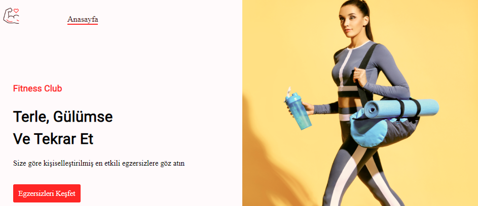
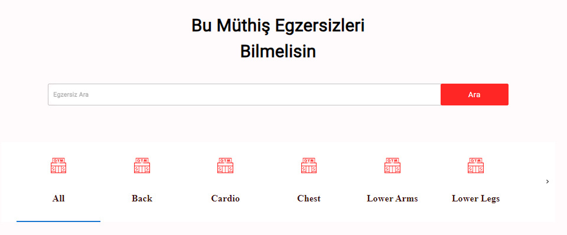
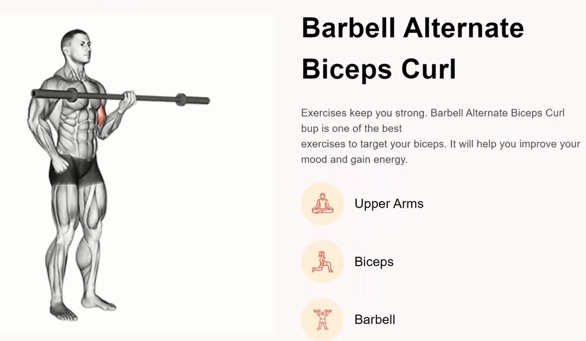

# Fitness Egzersizleri Uygulaması

### 💡 Kazanımlar

- useState, useEffect kullanımı

- Rapid API ile birden fazla apiye istek atma

- json tipindeki veriyi okuma ve kullanma

- Material UI kullanımı

### 🛠️ Fonksiyonlar

- Egzersizlerin listelenmesi

- Egzersizlerin filtrelenmesi

- Egzersiz arama

- Seçilen egzersizle alakalı görsel ve sözel detaylar

- Seçilen egzersize uygun youtube video kaynağı önerileri

Malesef RapidAPI kullanırken belirli bir süre içinde kullanıcı tarafından yapılan API isteklerinin
belirlenen bant genişliği sınırlarını aştığı için projenin çalışır bir linkini koymadım.

Proje ile alakalı fotoğrafları inceleyebilirsiniz.

